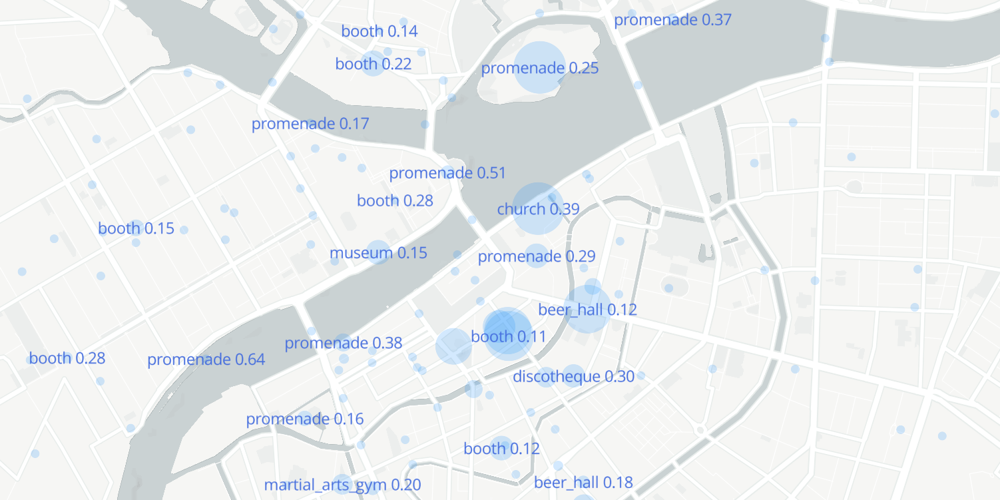

# voyage

Scripts for Instagram locations data scraping and interactive city features visualization

### Data collection

Scripts should be executed in the following order

`scrapers/locations_scraper.py -c [city]` scrape Instagram locations ([ChromeDriver](http://chromedriver.chromium.org/) reqiured)

`scrapers/locations_rank.py -c [city]` rank locations by popularity

`scrapers/photos_scraper.py -c [city]` scrape Instagram photos

`scrapers/reverse_geocoding.py -c [city]` get streets names ([Google Geocoding API](https://developers.google.com/maps/documentation/geocoding/start) token required)

`scrapers/wiki_scraper.py -c [city]` scrape wiki about locations, views, etc.

`places_cnn/scene_tagger.py -c [city]` scenes photo tagger ([Places365](https://github.com/CSAILVision/places365) used)

`faces/faces.py -c [city]` detect faces on photos

### List of  notebooks
* [Moscow](https://nbviewer.jupyter.org/github/pskryuchkov/voyage/blob/master/notebooks/moscow.ipynb) 
* [Saint Petersburg](https://nbviewer.jupyter.org/github/pskryuchkov/voyage/blob/master/notebooks/spb.ipynb) 
* [Tula](https://nbviewer.jupyter.org/github/pskryuchkov/voyage/blob/master/notebooks/tula.ipynb) 
* [Berlin](https://nbviewer.jupyter.org/github/pskryuchkov/voyage/blob/master/notebooks/berlin.ipynb)
* [Rome](https://nbviewer.jupyter.org/github/pskryuchkov/voyage/blob/master/notebooks/rome.ipynb) 
* [Hong Kong](https://nbviewer.jupyter.org/github/pskryuchkov/voyage/blob/master/notebooks/hong_kong.ipynb)

For local notebooks execution [Mapbox API](https://www.mapbox.com/) token required
